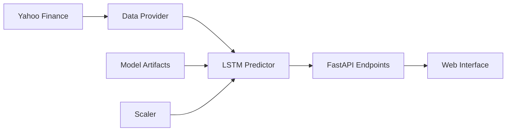

# 🚀 PETR4.SA Prediction System

<div align="center">

**Sistema de Predição de Preços da Ação PETR4.SA usando Deep Learning LSTM**

[🚀 Demo](#-como-executar) • [📖 Documentação](#-documentação) • [🐳 Docker](#-docker) • [🤝 Contribuição](#-contribuição)

</div>

---

## 🎯 **Sobre o Projeto**

Sistema especializado em **predição de preços da ação PETR4.SA** (Petróleo Brasileiro S.A.) utilizando **redes neurais LSTM** (Long Short-Term Memory). O modelo foi treinado com **10 anos de dados históricos** (2015-2025) para fornecer predições precisas de 1 a 10 dias à frente.

### 🧠 **Como Funciona**

1. **Coleta de Dados**: Obtém dados históricos da PETR4.SA via Yahoo Finance API
2. **Preprocessamento**: Normaliza os preços usando MinMaxScaler (0-1)
3. **Sequenciamento**: Cria sequências de 10 dias para alimentar o modelo LSTM
4. **Predição**: Modelo LSTM processa a sequência e prediz o próximo preço
5. **Pós-processamento**: Desnormaliza o resultado e calcula métricas de confiança

### 📊 **Arquitetura do Sistema**



---

## 🌟 **Características Principais**

| Característica | Descrição |
|---|---|
| 🎯 **Modelo Específico** | LSTM treinado exclusivamente com dados da PETR4.SA |
| 📈 **Alta Precisão** | RMSE de 1.2 (~4% de erro percentual) |
| ⚡ **Performance** | Cache inteligente de 15min + fallbacks automáticos |
| 🔒 **Robustez** | Múltiplas tentativas de períodos + tratamento de erros |
| 📊 **Confiança** | Score baseado em volatilidade e consistência histórica |
| 🔄 **Real-time** | Dados atualizados automaticamente do Yahoo Finance |

---

## 🚀 **Como Executar**

### 📋 **Pré-requisitos**

- Python 3.11+
- Poetry (gerenciamento de dependências)
- Conexão com internet (para dados do Yahoo Finance)

### 💻 **Instalação Local**

```bash
# 1. Clone o repositório
git clone https://github.com/ghpascon/tech_challenge_fase4.git
cd tech_challenge_fase4

# 2. Instale as dependências
poetry install

# 3. Ative o ambiente virtual
poetry shell

# 4. Execute o servidor
python main.py
```

### 🐳 **Docker (Recomendado)**

```bash
# 1. Build da imagem
docker build -t petr4-prediction .

# 2. Execute o container
docker run -p 5000:5000 petr4-prediction

# Ou use docker-compose
docker-compose up -d
```

### 🌐 **Acesso**

- **Interface Web**: http://localhost:5000
- **Documentação Swagger**: http://localhost:5000/docs

---

## 📖 **Documentação da API**

### 🎯 **Endpoints Principais**

| Método | Endpoint | Descrição |
|---|---|---|
| `POST` | `/api/petr4/train` | Treinamento do modelo |
| `POST` | `/api/petr4/tuning` | Otimização do modelo |
| `POST` | `/api/petr4/predict` | Predição de preço futuro |
| `GET` | `/api/petr4/health` | Status do sistema |
| `GET` | `/api/petr4/model/info` | Informações do modelo |
| `GET` | `/api/petr4/current-price` | Preço atual da ação |

# Obs: não há um Endpoint específico para configuração porque
# ela é feita por meio de passagem de parâmetros no formato JSON 
# para o Endpoint de treinamento 

### 💡 **Exemplo de Uso**

```bash
# Predição de 1 dia
curl -X POST \"http://localhost:5000/api/petr4/predict\" \
  -H \"Content-Type: application/json\" \
  -d '{\"days_ahead\": 1}'

# Resposta esperada
{
  \"symbol\": \"PETR4.SA\",
  \"current_price\": 30.50,
  \"predicted_price\": 31.20,
  \"predicted_change\": 0.70,
  \"predicted_change_percentage\": 2.30,
  \"prediction_date\": \"2025-11-23\",
  \"confidence_score\": 0.85,
  \"model_version\": \"LSTM_v1.0\"
}
```

### 📊 **Parâmetros de Entrada**

```json
{
  \"days_ahead\": 1  // 1-10 dias à frente
}
```

---

## 🧮 **Modelo LSTM**

### 🏗️ **Arquitetura**

- **Camadas**: 2 LSTM layers com 64 neurônios cada
- **Dropout**: 0.2 para prevenir overfitting
- **Ativação**: Tanh (LSTM) + Linear (output)
- **Otimizador**: Adam (lr=0.001)
- **Loss Function**: MSE (Mean Squared Error)

### 📈 **Treinamento**

- **Dataset**: PETR4.SA (2015-2025)
- **Sequência**: 10 dias de preços históricos
- **Split**: 70% treino, 15% validação, 15% teste
- **Épocas**: 200 com early stopping
- **Batch Size**: 32

### 🎯 **Performance**

| Métrica | Valor |
|---|---|
| **RMSE** | 1.2 |
| **RMSE %** | ~4% |
| **Confiança Média** | 0.75-0.90 |
| **Tempo de Predição** | ~50ms |

---

## 🛠️ **Estrutura do Projeto**

```
tech_challenge_fase4/
├── 📁 app/                          # Código principal da aplicação
│   ├── 📁 routers/api/             
│   │   └── pred.py                  # Endpoints da API
│   ├── 📁 services/ml/             
│   │   ├── petr4_predictor_lit.py   # Preditor LSTM específico
│   │   ├── petr4_train.py           # Treinamento do modelo
│   │   ├── petr4_tuning.py          # Otimização do modelo
│   │   ├── validators.py            # Schemas Pydantic
│   │   └── __init__.py             
│   ├── 📁 core/                    # Configurações e utilitários
│   ├── 📁 static/                  # Arquivos estáticos (CSS/JS)
│   └── 📁 templates/               # Templates HTML
├── 📁 model_pipeline/              # Artefatos do modelo ML
│   ├── 📁 artifacts/              
│   │   ├── best_model.pth          # Modelo LSTM treinado
│   │   ├── tuned_model.pth         # Modelo LSTM otimizado
│   │   └── scaler.joblib           # Normalizador MinMax
│   └── lstm.ipynb                  # Notebook de treinamento
├── 🐳 Dockerfile                   # Container Docker
├── 📋 pyproject.toml               # Dependências Poetry
├── 🚀 main.py                      # Ponto de entrada
├── 📖 README.md                    # Esta documentação
└── 📄 SWAGGER.MD                   # Documentação da API
```

---

## 🔧 **Tecnologias**

### 🐍 **Backend**
- **FastAPI**: Framework web assíncrono e moderno
- **PyTorch**: Deep Learning e redes neurais LSTM
- **Lightning**: Framework para PyTorch
- **Scikit-learn**: Pré-processamento e normalização
- **Pydantic v2**: Validação de dados e serialização
- **Uvicorn**: Servidor ASGI de alta performance

### 📊 **Dados**
- **yfinance**: API para dados financeiros Yahoo Finance
- **pandas**: Manipulação e análise de dados
- **numpy**: Computação numérica

### 🛠️ **DevOps**
- **Docker**: Containerização da aplicação
- **Poetry**: Gerenciamento de dependências
- **MLflow**: Tracking de experimentos ML

---

## 📊 **Monitoramento**

### 📈 **Logs**
O sistema inclui logging detalhado para:
- ✅ Requisições de predição
- ✅ Carregamento de dados
- ✅ Performance do modelo
- ✅ Cache hits/misses
- ✅ Erros e exceções

### 🏥 **Health Checks**
- **Endpoint**: `/api/petr4/health`
- **Verifica**: Modelo carregado, conectividade de dados, preço atual
- **Formato**: JSON com status, timestamp e métricas

---
